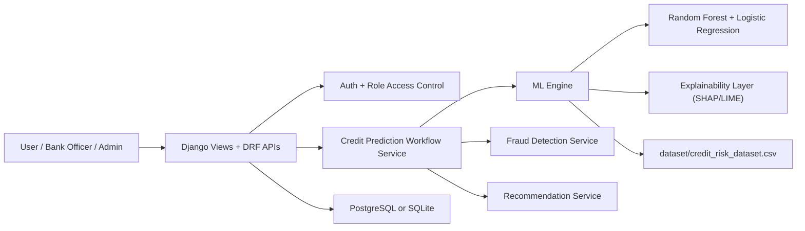
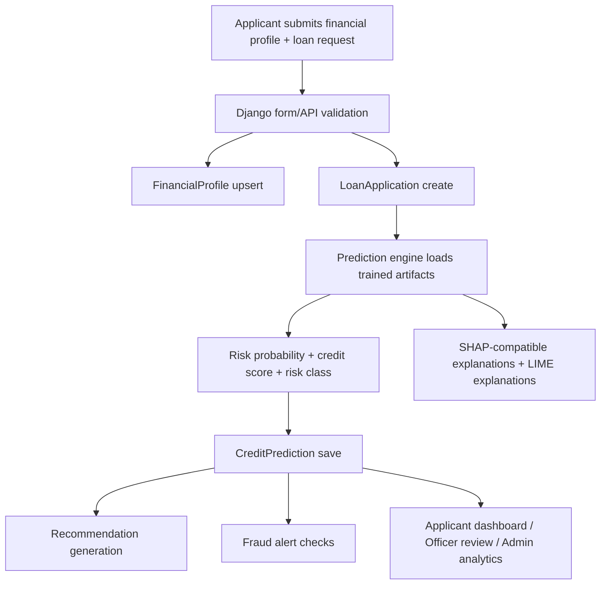
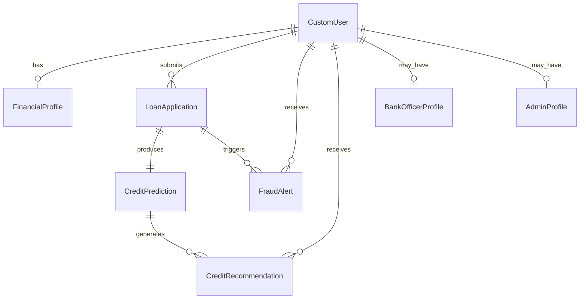

# CreditSense AI Architecture

## 1. System Architecture Diagram



## 2. Data Flow Diagram



## 3. AI Model Pipeline

1. Load the real dataset from `dataset/credit_risk_dataset.csv`.
2. Drop rows with missing `person_emp_length` or `loan_int_rate`.
3. Label-encode categorical columns:
   - `person_home_ownership`
   - `loan_intent`
   - `loan_grade`
   - `cb_person_default_on_file`
4. Scale features with `StandardScaler`.
5. Train:
   - `RandomForestClassifier`
   - `LogisticRegression`
6. Average the model probabilities into the runtime ensemble score.
7. Convert probability into:
   - `credit_score` between 300 and 850
   - `risk_category` = Low / Medium / High
8. Generate explainability output:
   - SHAP when importable in the environment
   - deterministic feature-contribution fallback if SHAP import fails
   - LIME explanations for local feature conditions

## 4. Django Backend Architecture

- `authentication/`
  - landing page
  - registration / login / logout
  - login audit trail
- `users/`
  - custom user model with roles
  - financial profile
  - applicant dashboard and history
- `credit_prediction/`
  - loan application
  - prediction record
  - fraud alert
  - prediction orchestration service
- `recommendations/`
  - score improvement suggestions
- `bank_officer/`
  - officer profile
  - review and decision workflow
- `admin_panel/`
  - user management
  - fraud monitoring
  - model monitoring
- `analytics/`
  - monitoring snapshot storage
  - aggregate dashboard metrics
- `api/`
  - role-based REST endpoints

## 5. Frontend Architecture

- Shared base template in `templates/base/base.html`
- Role-aware navigation
- Applicant pages:
  - dashboard
  - analysis form
  - history
  - recommendations
  - profile
- Officer pages:
  - dashboard
  - applications
  - risk analysis
  - fraud alerts
  - reports
- Admin pages:
  - dashboard
  - user management
  - model monitoring
  - fraud monitoring
  - analytics
- Styling:
  - Bootstrap for layout
  - custom CSS in `static/css/app.css`
  - light JS behavior in `static/js/app.js`

## 6. Database Schema



## 7. Security Design

- Django session authentication with CSRF protection
- Role-based access control at view and API layer
- Public registration limited to applicant role
- Sensitive settings sourced from environment variables
- PostgreSQL supported for production deployments
- Login audit model for authentication traceability
- Fraud alerts for anomalous application behavior

## 8. Folder Structure Purpose

- `dataset/`: the only training/reference dataset used by the ML engine
- `ml_engine/prediction_model/`: training script, artifact loading, runtime predictor
- `ml_engine/explainable_ai/`: explanation formatting helpers
- `ml_engine/fraud_detection/`: fraud scoring logic based on real-data thresholds
- `authentication/`: auth pages, forms, login audit
- `users/`: applicant role, profile, dashboard
- `bank_officer/`: officer role dashboards and decision flow
- `admin_panel/`: platform administration
- `credit_prediction/`: application, prediction, fraud entities and workflow
- `recommendations/`: suggestion generation and display
- `analytics/`: model and system metrics
- `templates/`: HTML presentation layer
- `static/`: CSS/JS assets

## 9. Complete Workflow

1. Applicant registers and logs in.
2. Applicant fills financial profile and loan application fields.
3. Django saves/updates the profile and application.
4. ML engine predicts default probability from the real dataset feature space.
5. System derives credit score and risk category.
6. Explainability module generates SHAP/LIME outputs.
7. Fraud detector evaluates outlier exposure and repeat application behavior.
8. Recommendation engine creates improvement suggestions.
9. Officer reviews applications and records approve/reject decisions.
10. Admin monitors users, alerts, analytics, and model metrics.

## 10. Dependencies

- Django
- Django REST Framework
- pandas
- numpy
- scikit-learn
- shap
- lime
- psycopg2-binary

## 11. Database Migrations

```bash
python manage.py makemigrations authentication bank_officer admin_panel analytics recommendations credit_prediction users
python manage.py migrate
```

## 12. Run Commands

```bash
python ml_engine/prediction_model/train.py
python manage.py runserver
python manage.py test
```

## 13. Deployment Notes

- Set PostgreSQL environment variables in production.
- Set `DJANGO_SECRET_KEY` and `DJANGO_DEBUG=False`.
- Add real hostnames to `DJANGO_ALLOWED_HOSTS`.
- Serve static files from `staticfiles/`.
- Retrain artifacts whenever the dataset or feature engineering changes.

## 14. Dataset Reality Note

The provided real dataset does not contain literal columns named `credit_utilization` or `outstanding_liabilities`. The platform maps those business concepts to the real available columns:

- `loan_percent_income` as utilization / affordability pressure
- `loan_amnt` as outstanding liability pressure
- `cb_person_default_on_file` as repayment behavior signal
